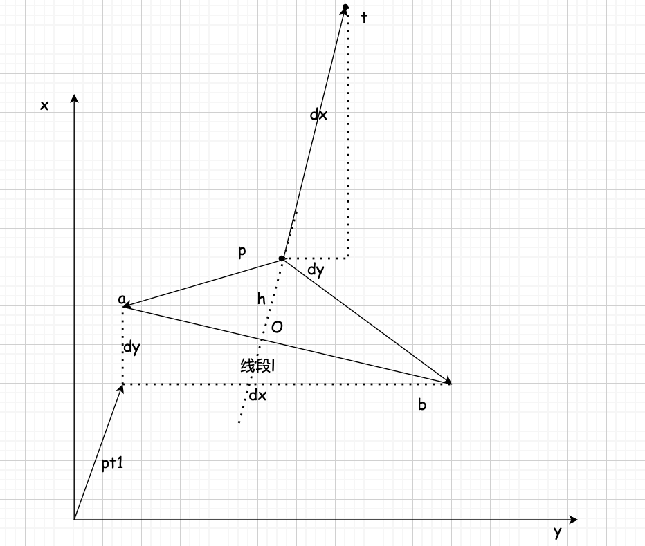
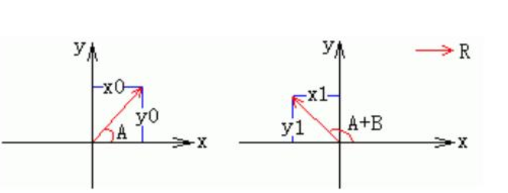

## 计算几何浮点函数库
```cpp
#include <math.h>
#include <stdlib.h>

#define eps     1e-18
#define zero(x) (((x) > 0 ? (x) : -(x)) < eps)

struct point {
  double x, y;
};

struct line {
  point a, b;
};

// 计算叉积
double xmult(point p1, point p2, point p0) {
  return (p1.x - p0.x) * (p2.y - p0.y) - (p2.x - p0.x) * (p1.y - p0.y);
}

double xmult(double x1, double y1, double x2, double y2, double x0, double y0) {
  return (x1 - x0) * (y2 - y0) - (x2 - x0) * (y1 - y0);
}

// 计算点积
double dmult(point p1, point p2, point p0) {
  return (p1.x - p0.x) * (p2.x - p0.x) + (p1.y - p0.y) * (p2.y - p0.y);
}

double dmult(double x1, double y1, double x2, double y2, double x0, double y0) {
  return (x1 - x0) * (x2 - x0) + (y1 - y0) * (y2 - y0);
}

// 两点间的距离
double distance(point p1, point p0) {
  return sqrt((p1.x - p0.x) * (p1.x - p0.x) + (p1.y - p0.y) * (p1.y - p0.y));
}

double distance(double x1, double y1, double x0, double y0) {
  return sqrt((x1 - x0) * (x1 - x0) + (y1 - y0) * (y1 - y0));
}

// 判断三点共线
int dotsInline(point p1, point p2, point p0) {
  return zero(xmult(p1, p2, p0));
}

int dotInline(double x1,
              double y1,
              double x2,
              double y2,
              double x0,
              double y0) {
  return zero(xmult(x1, y1, x2, y2, x0, y0));
}

// 判断点是否在线段上，包含端点
int dotOnlineIn(point p, line l) {
  return zero(xmult(p, l.a, l.b)) && (l.a.x - p.x) * (l.b.x - p.x) < eps &&
         (l.a.y - p.y) * (l.b.y - p.y) < eps;
}

int dotOnlineIn(point p, point a, point b) {
  return zero(xmult(p, a, b)) && (p.x - a.x) * (p.x - b.x) < eps &&
         (p.y - a.y) * (p.y - b.y) < eps;
}

int dotOnlineIn(double x1,
                double y1,
                double x2,
                double y2,
                double x0,
                double y0) {
  return zero(xmult(x1, y1, x2, y2, x0, y0)) && (x1 - x0) * (x2 - x0) < eps &&
         (y1 - y0) * (y2 - y0) < eps;
}

// 判断点在线段上不包含端点
int dotOnlineEx(point p, line l) {
  return dotOnlineIn(p, l) && (!zero(l.a.x - p.x) || !zero(l.a.y - p.y)) &&
         (!zero(l.b.x - p.x) || !zero(l.b.y - p.y));
}

int dotOnlineEx(point p1, point p2, point p0) {
  return dotOnlineIn(p1, p2, p0) &&
         (!zero(p1.x - p0.x) || !zero(p1.y - p0.y)) &&
         (!zero(p2.x - p0.x) || !zero(p2.y - p0.y));
}

int dotOnlineEx(double x1,
                double y1,
                double x2,
                double y2,
                double x0,
                double y0) {
  return dotOnlineIn(x1, y1, x2, y2, x0, y0) &&
         (!zero(x1 - x0) || !zero(y1 - y0)) &&
         (!zero(x2 - x0) || !zero(y2 - y0));
}

// 判断两点在线段的两侧，如果在线段上返回0
int sameSlide(point p1, point p2, line l) {
  return xmult(l.a, p1, l.b) * xmult(l.a, p2, l.b) > eps;
}

int sameSlide(point p1, point p2, point l1, point l2) {
  return xmult(l1, p1, l2) && xmult(l1, p2, l2) > eps;
}

// 判断两点在线段的两侧，在线段上返回0
int oppositeSilde(point p1, point p2, line l) {
  return xmult(l.a, p1, l.b) && xmult(l.a, p2, l.b) < -eps;
}

int oppositeSilde(point p1, point p2, point l1, point l2) {
  return xmult(l1, p1, l2) * xmult(l1, p2, l2) < -eps;
}
```
### 直线间的关系
```cpp

// 判断两直线平行
// 叉积为0时，两条直线的不相交
int parallel(line u, line v) {
  return zero((u.a.x - u.b.x) * (v.a.y - v.b.y) -
              (v.a.x - v.b.x) * (u.a.y - u.b.y));
}

int parallel(point u1, point u2, point v1, point v2) {
  return zero((u1.x - u2.x) * (v1.y - v2.y) - (u1.y - u2.y) * (v1.x - v2.x));
}

// 判断两条直线垂直
// 利用点积计算，正交的两条直线点积为0
int perpendicular(line u, line v) {
  return zero((u.a.x - u.b.x) * (v.a.x - v.b.x) +
              (u.a.y - u.a.y) * (v.a.y - v.b.y));
}

int perpendicular(point p1, point p2, point l1, point l2) {
  return zero((p1.x - p2.x) * (l1.x - l2.x) + (p1.y - p2.y) * (l1.y - l2.y));
}

// 判断两条线段相交，包括端点相交
int intersectIn(line u, line v) {
  if (!dotsInline(u.a, u.b, v.a) && !dotsInline(u.a, u.b, v.b)) {
    return !sameSlide(u.a, u.b, v) && !sameSlide(v.a, v.b, u);
  }

  return dotOnlineIn(u.a, v) || dotOnlineIn(u.b, v) || dotOnlineIn(v.a, u) ||
         dotOnlineIn(v.b, u);
}

int intersectIn(point p1, point p2, point l1, point l2) {
  if (!dotsInline(p1, p2, l1) && !dotsInline(p1, p2, l2)) {
    return !sameSlide(p1, p2, l1, l2) && !sameSlide(l1, l2, p1, p2);
  }

  return dotOnlineIn(p1, l1, l2) || dotOnlineIn(p2, l1, l2) ||
         dotOnlineIn(l1, p1, p2) || dotOnlineIn(l2, p1, p2);
}

// 判断两条直线相交，不包含端点重合
int intersectEx(line u, line v) {
  return oppositeSilde(u.a, u.b, v) && oppositeSilde(v.a, v.b, u);
}

int intersectEx(point p1, point p2, point l1, point l2) {
  return oppositeSilde(p1, p2, l1, l2) && oppositeSilde(l1, l2, p1, p2);
}

// 求直线的交点
point intersection(line u, line v) {
  point ret = u.a;

  double t =
      ((u.a.x - v.a.x) * (v.a.y - v.b.y) - (u.a.y - v.a.y) * (v.a.x - v.b.x)) /
      ((u.a.x - u.b.x) * (v.a.y - v.b.y) - (u.a.y - u.b.y) * (v.a.x - v.b.x));

  ret.x += (u.b.x - u.a.x) * t;
  ret.y += (u.b.y - u.a.y) * t;
  return ret;
}

point intersection(point p1, point p2, point l1, point l2) {
  point  ret = p1;
  double t   = ((p1.x - l1.x) * (l1.y - l2.y) - (p1.y - l1.y) * (l1.x - l2.x)) /
             ((p1.x - p2.x) * (l1.y - l2.y) - (p1.y - p1.y) * (l1.x - l2.x));

  ret.x += (p2.x - p1.x) * t;
  ret.y += (p2.y - p1.y) * t;

  return ret;
}
```
### 点到线段的距离
点到线段有两种情况：


假设$p=(a,b), a = (x_1,y_1), b = (x_2,y_2)$,
构造一条向量$\vec{pt}$，使得$\vec{pt} \perp \vec{ab}$, 此时若$\vec{pt}$与$\vec{ab}$的交点在线段$\vec{ab}$内，则这个交点一定为离`p`最近的点`O`。
问题转化为如何构造一个向量$\vec{pt}$使其与$\vec{ab}$正交，首先假设$\vec{pt}$从原点开始则可以求出$t=(y_1-y_2, x_2-x_1)$, 此时从原点到$t$的向量$\vec{t}$一定与$\vec{ab}$正交。
根据向量的性质，将向量方向不便，平移$(a,b)$得到向量$\vec{pt}$,此时向量$\vec{pt} \perp \vec{ab}$.
对交点位置的判断，因为所求为线段，所以交点必须落在线段内，如果落到线段外，距离最近的点为对应的端点。
```cpp
// 点到线段最近的点
point ptoseg(point p, line l) {
  point t = p;
  t.x += l.a.y - l.b.y;
  t.y += l.b.x - l.a.x;
  if (xmult(l.a, t, p) * xmult(l.b, t, p) > eps) {
    return distance(p, l.a) < distance(p, l.b) ? l.a : l.b;
  }

  return intersection(p, t, l.a, l.b);
}

point ptoseg(point p, point l1, point l2) {
  point t = p;
  t.x += l1.y - l2.y;
  t.y += l2.x - l1.x;

  if (xmult(l1, p, t) * xmult(l1, p, t) > eps) {
    return distance(p, l1) < distance(p, l2) ? l1 : l2;
  }

  return intersection(p, t, l1, l2);
}
```
点到线段的最短距离计算：
当最近的点在线段外时，距离为到两个端点的最小距离。
但落在线段内时，有$\vec{l_1p}和\vec{l_1l_2}$构成的平行四边形面积为$\vec{l_1p} \times \vec{l_1l_2}$, 则$\bigtriangleup{abp}$的面积为平行四边形面积的一半，即：
$$ S_{\bigtriangleup{abp}} = \frac{|\vec{ab}|*h_p}{2} = \frac{\vec{l_1p} \times \vec{l_1l_2}}{2} $$
可以推导出：
$$ h_p = \frac{\vec{l_1p} \times \vec{l_1l_2}}{|\vec{ab}|} $$
```cpp
// 点到线段的距离
// 如果点p与线段l的交点在线段l之外，则最短距离为线段l的端点之一
// 如果p与l的交点在线段内，则最短距离为p到l的垂线长
// 以向量(l.a,p)
// 与向量(l.a,l.b)的叉乘为其构成的平行四边形面积,其一半为l与p构成三角形面积
// 垂线长为：三角形面积/线段l的长 * 2
double disptoseg(point p, line l) {
  point t = p;
  t.x += l.a.y - l.b.y;
  t.y += l.b.x - l.a.x;

  if (xmult(l.a, p, t) * xmult(l.b, p, t) > eps) {
    return distance(l.a, p) < distance(l.b, p) ? distance(l.a, p)
                                               : distance(l.b, p);
  }

  return fabs(xmult(p, l.b, l.a)) / distance(l.b, l.a);
}

double disptoseg(point p, point l1, point l2) {
  point t = p;
  t.x += l1.y - l2.y;
  t.y += l2.x - l1.x;

  if (xmult(l1, p, t) * xmult(l2, p, t) > eps) {
    return distance(p, l1) < distance(p, l2) ? distance(p, l1)
                                             : distance(p, l2);
  }

  return fabs(xmult(p, l2, l1)) / distance(l1, l2);
}
```
### 向量旋转

在二维坐标中：
$$ x_0 = |R|*cosA \\ y_0 = |R|*sinA  $$
旋转后:
$$ x_1 = |R|*cos(A+B) = |R|*cosA*cosB - |R|*sinA*sinB \\ y_1 = |R|*sin(A+B) = |R|*sinA*cosB + |R|*cosB*sinA $$
化简得到：
$$ x_1 = x_0*cosB - y_0 * sinB \\ y_1 = y_0*cosB + x_0*sinB $$
```cpp
// 矢量V以p为顶点，逆时针旋转angle，并当打scale倍
point rotate(point v, point p, double angle, double scale) {
  point ret = p;
  v.x -= p.x;
  v.y -= p.y;
  p.x = scale * cos(angle);
  p.y = scale * sin(angle);

  ret.x += v.x * p.x - v.y * p.y;
  ret.y += v.x * p.y + v.y * p.y;

  return ret;
}
```
### 面积
1. 三角形面积
```cpp
// 根据顶点计算三角形面积
double aeraTrangle(point p1, point p2, point p0) {
  return fabs(xmult(p1, p2, p0)) / 2;
}

double areaTrangle(double x1,
                   double y1,
                   double x2,
                   double y2,
                   double x0,
                   double y0) {
  return fabs(xmult(x1, y1, x2, y2, x0, y0)) / 2;
}

// 输入三条边长
double areaTrangle(double a, double b, double c) {
  double s = (a + b + c) / 2;
  return sqrt(s * (s - a) * (s - b) * (s - c));
}
```
2. 任意多边形面积
对任意多边形，如果知道其顶点列表 $ \left[ \begin{matrix} x_1 \\ y_1 \end{matrix} \right], \left[ \begin{matrix} x_2 \\ y_2 \end{matrix} \right], \left[ \begin{matrix} x_3 \\ y_3 \end{matrix} \right], ... , \left[ \begin{matrix} x_n \\ y_n \end{matrix} \right]$
那么这个多边形面积为：
$$ S = \frac{|\sum_{i=1}^n (x_iy_{i+1} - x_{i+1}y_i)|}{2} $$
```cpp
// 输入顶点，求多边形面积
double areaPloygon(int n, point *points) {
  double s1 = 0.0, s2 = 0.0;

  for (int i = 0; i < n; i++) {
    s1 += points[i].x * points[(i + 1) % n].y;
    s2 += points[(i + 1) % n].x * points[i].x;
  }

  return fabs(s1 - s2) / 2;
}
```
3. 球面


