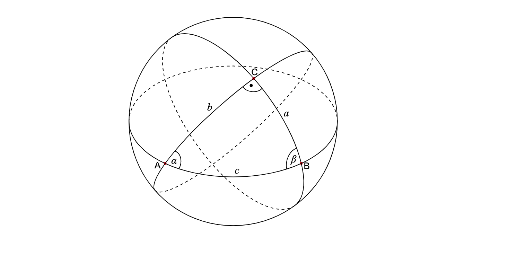

## 球面
### 求夹角


令$ \phi_s , \lambda_s, \phi_q, \lambda_q $ 代表球面上两点的经度和纬度(`s`代表出发点,`f`代表目的点)，$\bigtriangleup_\phi, \bigtriangleup_\lambda$代表两者的绝对值之差,那么两者之间的圆心角由**球面余弦定理可以得出：**
$$\bigtriangleup_{\hat{\sigma}} = arccos(sin{\phi_s}*sin{\phi_f} + cos{\phi_s}*cos{\phi_f}*cos{(\bigtriangleup_\lambda)})$$
两点间的距离为：
$$ d = r * \bigtriangleup_{\hat{\sigma}} $$
在两点间的距离相对球面半径很小时，其圆心角很小，余弦值接近1，可以利用如下函数求的圆心角：
$$\bigtriangleup_{\hat{\sigma}} = 2 * arcsin \left( \sqrt{sin^2(\frac{\bigtriangleup_\phi}{2})+cos(\phi_s)*cos(\phi_f)*sin^2(\frac{\bigtriangleup_lambda}{2})} \right)$$

1. 计算圆心夹角
```cpp
// 计算圆心角lat表示纬度，-90 <= w <= 90,lng表示经度
// 返回两点所在的大圆劣弧所对应的圆心角, 0 <= andle <=pi
// 根据圆心角计算公式，首先求的纬度的差值，为消除误差采用 *pi/180的方式
// 因为要求的角度为锐角，所以需要判断差值与pi的关系，将dlng转化到0~pi的范围内
// 同样的对经度做误差校验，消除误差
// 利用反余弦求的夹角
double angle(double lng1, double lat1, double lng2, double lat2) {
  double dlng = fabs(lng1 - lng2) * pi / 180;
  while (dlng >= pi + pi) {
    dlng -= pi + pi;
  }
  if (dlng > pi) {
    dlng = pi + pi - dlng;
  }
  lat1 *= pi / 180;
  lat2 *= pi / 180;

  return acos(cos(lat1) * cos(lat2) * cos(dlng) + sin(lat1) * sin(lat2));
}
```
2. 计算球面距离
```cpp
// 计算距离，r为球面半径
double distance(double r, double lng1, double lat1, double lng2, double lat2) {
  double dlng = fabs(lng1 - lng2) * pi / 180;

  if (dlng >= pi + pi) {
    dlng -= pi + pi;
  }

  if (dlng > pi) {
    dlng = pi + pi - dlng;
  }

  lat1 *= pi / 180;
  lat2 *= pi / 180;

  return r * sqrt(2 - 2 * (cos(lat1) * cos(lat2) * cos(dlng) +
                           sin(lat1) * sin(lat2)));
}

// 计算球面距离，r为球面半径
double sphereDist(double r,
                  double lng1,
                  double lat1,
                  double lng2,
                  double lat2) {
  return r * angle(lng1, lat1, lng2, lat2);
}
```


